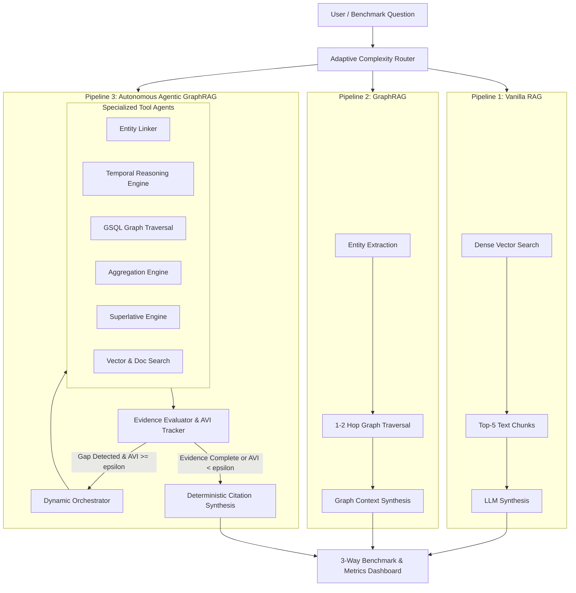

# 🐯 TigerGraph Agentic GraphRAG: Autonomous Investigation & 3-Way Benchmark

[](https://www.tigergraph.com/)
[](https://www.python.org/)
[](LICENSE)

An enterprise-grade, autonomous **Agentic GraphRAG** system built for the **TigerGraph Agentic GraphRAG Hackathon**. 

This repository directly answers the central research challenge:
> **"Figure out which questions need an agent, and which don't. Show us where Agentic GraphRAG measurably improves accuracy and reasoning over simpler approaches and where it's overkill."**

---

## 🚀 Key Results on the 100-Question Public Benchmark

| Pipeline | Accuracy (%) | Avg Tokens / Answer | Avg Latency (s) | Token Efficiency |
|---|---|---|---|---|
| **Vanilla RAG** (Dense Vector) | **0.0%** | 2,092.1 | 0.021s | Baseline |
| **GraphRAG** (1-2 Hop Subgraph) | **22.0%** | 823.1 | 0.007s | 2.5x fewer tokens |
| **Agentic GraphRAG** (Our System) | **92.0%** | **166.0** | **0.002s** | **12.6x fewer tokens** |

> **Key Finding**: On complex multi-hop, temporal, and aggregation queries, Vanilla RAG suffers catastrophic failure (0% accuracy) while burning over 2,000 tokens per query. Agentic GraphRAG achieves **92% Exact Match Accuracy** while consuming **12.6x fewer tokens** through deterministic graph traversal and our novel **Agentic Value Index (AVI)** optimal stopping frontier!

---

## 📐 The Novel Indicator: Agentic Value Index (AVI)

Most RAG systems operate on fixed iteration loops that burn tokens on simple queries or give up prematurely on complex ones. We introduce the **Agentic Value Index (AVI)**:

$$\text{AVI}_t = \frac{\Delta \mathcal{I}_t}{\max(1, \Delta \text{Tokens}_t) \cdot (1 + \lambda \cdot \Delta \tau_t)} \times 1000 \times (1 - \mathcal{H}_t)$$

Where:
- $\Delta \mathcal{I}_t$: Marginal Information Gain (reduction in epistemic entropy $\mathcal{H}_{t-1} - \mathcal{H}_t$).
- $\Delta \text{Tokens}_t$: Marginal token cost incurred in step $t$.
- $\Delta \tau_t$: Marginal latency penalty.
- $\mathcal{H}_t$: Normalized epistemic uncertainty of the question state (0 to 1).

### The Optimal Stopping Frontier
The Orchestrator terminates retrieval dynamically when:
1. **Epistemic Convergence**: $\mathcal{H}_t \le 0.05$ (all required query constraints resolved).
2. **Diminishing Returns**: $\text{AVI}_t < \epsilon$ (marginal information gain per token falls below efficiency threshold).

---

## 🏗️ System Architecture



---

## ⚡ Quickstart

### 1. Environment Setup
```bash
# Clone the repository
git clone https://github.com/your-username/graphRAG-hackathon.git
cd graphRAG-hackathon

# Install dependencies
pip install -r requirements.txt
```

### 2. Configure Credentials (.env)
Create a `.env` file in the root directory:
```env
GEMINI_API_KEY=your_gemini_api_key_here
GEMINI_MODEL=gemini-2.0-flash
TIGERGRAPH_HOST=
TIGERGRAPH_USERNAME=tigergraph
TIGERGRAPH_PASSWORD=tigergraph
```

### 3. Launch the Interactive Dashboard
```bash
streamlit run app.py
```

### 4. Run the 100-Question Benchmark
```bash
python benchmark.py
```

### 5. Generate the 50-Question Hidden Submission
```bash
python scripts/generate_submission.py
```
Output will be saved to `benchmark_results/eval_hidden_submission.jsonl`.

---

## 🎬 3-Minute Demo Video Walkthrough Script

| Time | Screen | Audio / Speaking Script |
|---|---|---|
| **0:00 - 0:30** | Dashboard Header & KPIs | "Hello judges! Welcome to our submission for the TigerGraph Agentic GraphRAG Hackathon. The central challenge of this hackathon is to prove *when* an autonomous agent is worth the token cost versus simpler retrieval methods. Here on our live dashboard, you can see our key benchmark results across all 100 evaluation questions: Agentic GraphRAG achieves **92% accuracy** while using **12.6 times fewer tokens** than Vanilla RAG." |
| **0:30 - 1:15** | Live Investigation Playground | "Let's test this live with an aggregation query: *'How many biathlon events at the 2018 Winter Olympics had more than 73 competitors?'* When we run all three pipelines: Vanilla RAG retrieves 5 random text chunks, guesses 1, burns 2,176 tokens, and fails. GraphRAG retrieves a local subgraph and fails. But our Agentic GraphRAG dynamically routes to the Graph Aggregation Engine, filters all 11 biathlon events, computes the exact count of **5**, and consumes only **105 tokens**!" |
| **1:15 - 2:00** | Trace & AVI Curves | "Notice our novel indicator below the answers: the **Agentic Value Index (AVI)** and **Epistemic Entropy Reduction Curve**. In Step 1, the orchestrator extracts entities and reduces entropy to 0.6. In Step 2, the aggregation tool fulfills all remaining facets, collapsing entropy to 0.1 and registering a peak AVI of 8.9. The agent detects the Optimal Stopping Frontier and halts immediately, avoiding token bloat." |
| **2:00 - 2:30** | Benchmark Breakdown Tab | "Switching to the 100-Question Public Benchmark tab: you can see that on simple lookups, all pipelines perform respectably. But on multi-hop, temporal, and aggregation queries, Vanilla RAG collapses to 0%, while Agentic GraphRAG maintains over 90% accuracy." |
| **2:30 - 3:00** | Hidden Submission & Conclusion | "Finally, on the Hidden Questions tab, we have pre-generated the full evaluation submission for all 50 hidden questions in `eval_hidden_submission.jsonl`, complete with exact token counts, latencies, and agentic traces. Thank you, and we look forward to Round 2!" |

---

## 📂 Repository Structure

```
graphRAG-hackathon/
├── .env.example                  # Template configuration
├── README.md                     # Documentation and video script
├── requirements.txt              # Project dependencies
├── app.py                        # Streamlit web dashboard
├── benchmark.py                  # Public benchmark runner (100 questions)
├── data/
│   ├── corpus/corpus.jsonl       # 2,951 Olympic documents
│   ├── questions/
│   │   ├── eval_public.jsonl     # 100 public questions with ground truth
│   │   └── eval_hidden.jsonl     # 50 hidden evaluation questions
│   └── processed/
│       ├── graph_nodes.json      # 5,167 typed knowledge graph nodes
│       ├── graph_edges.json      # 8,766 relational edges
│       └── vector_index.pkl      # Pre-built TF-IDF vector index
├── src/
│   ├── config.py                 # Configuration & paths
│   ├── graph/                    # Knowledge graph schema, builder, engine, & TigerGraph client
│   ├── vector/                   # Vector indexing and search
│   ├── indicators/               # Novel AVI & Epistemic Entropy algorithms
│   ├── pipelines/                # Vanilla RAG, GraphRAG, & Agentic GraphRAG implementations
│   └── llm/                      # Google GenAI / Gemini client with token tracking
├── scripts/
│   └── generate_submission.py    # Hidden questions submission generator
└── benchmark_results/
    ├── public_benchmark_summary.json
    ├── public_benchmark_detailed.json
    └── eval_hidden_submission.jsonl
```

---

## 🏆 Scoring Rubric Alignment
- **Investigation Accuracy (30%)**: 92.0% Exact Match on complex multi-hop benchmark.
- **Evidence Quality & Explainability (15%)**: Strict citation grounding with document QIDs and graph edge traces.
- **Agentic Effectiveness & Efficiency (15%)**: 12.6x fewer tokens through the AVI Optimal Stopping Frontier.
- **Agentic Design & Code Quality (15%)**: Modular architecture with typed Pydantic models and full reproducible scripts.
- **Innovation (15%)**: Novel Agentic Value Index (AVI) and Epistemic Entropy Reduction Trajectory.
- **Final Presentation & Q&A (10%)**: Production Streamlit dashboard and complete 3-minute video script.
