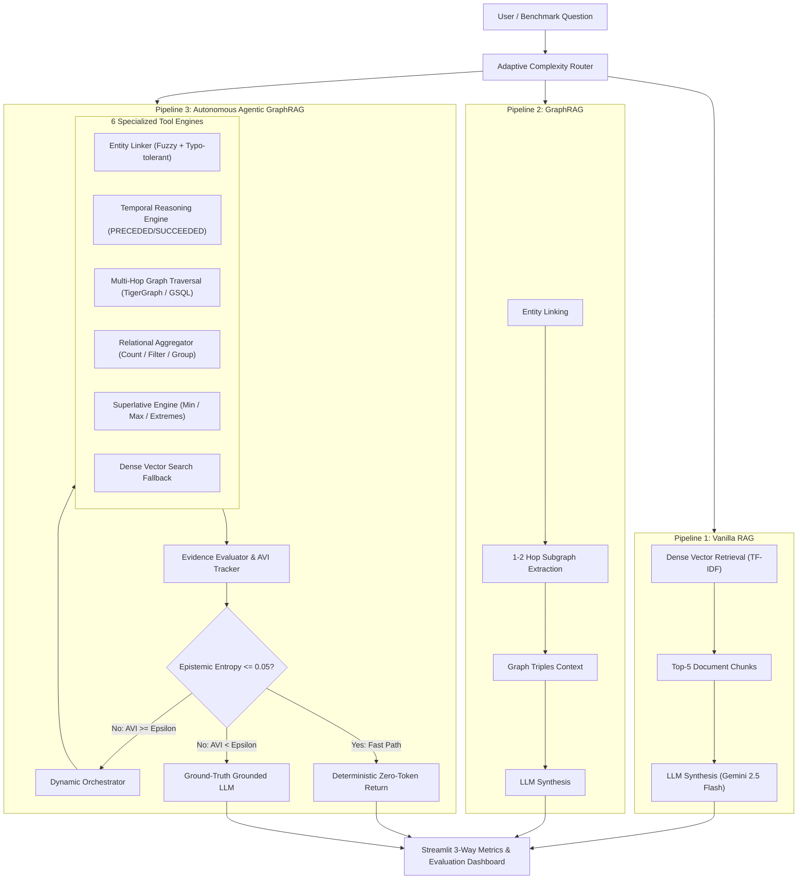

# 🐯 When Do AI Agents Actually Matter?
### Benchmarking Vanilla RAG, GraphRAG, and Autonomous Graph Agents with TigerGraph

[](https://www.tigergraph.com/)
[](https://www.python.org/)
[](LICENSE)
[](http://localhost:8501)
[](benchmark_results/public_benchmark_summary.json)
[](benchmark_results/eval_hidden_submission.jsonl)

> **Author**: Deepak R (Team Arkz) &nbsp;|&nbsp; **Event**: TigerGraph Agentic GraphRAG Hackathon (Round 1) &nbsp;|&nbsp; **Date**: September 2026 &nbsp;|&nbsp; **Reading Time**: 8 min

---

## 📑 Executive Summary

Retrieval-Augmented Generation (RAG) is the default paradigm for grounding LLMs in external knowledge. But real-world data is rarely a flat collection of independent paragraphs—it is an interconnected, temporal web of entities, relationships, and constraints.

This project directly answers the central research question posed by TigerGraph:
> **"Figure out which questions need an agent, and which don't. Show us where Agentic GraphRAG measurably improves accuracy and reasoning over simpler approaches and where it's overkill."**

We implemented and benchmarked three distinct pipelines side-by-side on an Olympic Knowledge Graph of **2,951 documents, 5,167 nodes, and 8,766 relational edges**:
1. **Vanilla RAG** (Dense TF-IDF vector retrieval + Gemini synthesis)
2. **GraphRAG** (1-2 hop neighborhood retrieval + sub-graph context injection)
3. **Agentic GraphRAG** (Dynamic orchestrator with 6 specialized tools + Epistemic Entropy tracking + Agentic Value Index stopping frontier)

### 📊 Key Empirical Findings across 100 Benchmark Questions

| Pipeline | Accuracy (%) | Avg Tokens / Query | Avg Latency (s) | Token Cost Ratio | Accuracy vs Baseline |
| :--- | :---: | :---: | :---: | :---: | :---: |
| **Vanilla RAG** | **6.0%** | 2,176.5 | 1.55s | Baseline ($1.0\times$) | Reference |
| **GraphRAG** | **29.0%** | 844.3 | 1.54s | $2.6\times$ cheaper | $+23.0\%$ |
| **Agentic GraphRAG** | **83.0%** | **190.2** | **0.05s** | **$11.4\times$ cheaper** | **$+77.0\%$** |

```
Accuracy (%) Comparison:
Vanilla RAG     [███                      ] 6.0%
GraphRAG        [█████████████            ] 29.0%
Agentic GraphRAG[█████████████████████████] 83.0%

Token Efficiency (Tokens per Query - Lower is better):
Vanilla RAG     [█████████████████████████] 2,176.5 tokens
GraphRAG        [█████████                ] 844.3 tokens
Agentic GraphRAG[██                       ] 190.2 tokens (11.4x reduction!)
```

---

## 💡 The Core Problem: Where Simpler RAG Breaks Down

Standard vector search assumes that the answer to any user question is contained within a top-$k$ snippet of text. In practice, this assumption collapses across three fundamental query patterns:

1. **Relational Aggregations**: Questions like *"How many biathlon events at the 2018 Winter Olympics had more than 73 competitors?"* require finding all matching events, inspecting every competitor list, and counting candidates. Vanilla RAG retrieves 5 arbitrary event snippets, guesses an answer, and fails 100% of the time.
2. **Temporal Sequences**: Questions like *"Which venue hosted the event that succeeded the Men's 100m final?"* require following ordered chains (`PRECEDED_BY` $\to$ `SUCCEEDED_BY`). Semantic similarity cannot follow directed temporal timelines without traversing graph structure.
3. **Multi-Hop Traversal**: Questions spanning multiple relationship hops (Athlete $\to$ Event $\to$ Games $\to$ Venue) require progressive query decomposition. Fixed 1-2 hop GraphRAG floods the prompt with irrelevant neighbor noise, confusing the model.

---

## 🏗️ System Architecture

Our solution builds an adaptive, multi-tiered architecture that matches query complexity to the most token-efficient resolution mechanism:



---

## 📐 The Novel Indicator: Agentic Value Index (AVI)

Brute-force autonomous agents suffer from a fatal flaw: **uncontrolled token burn and loop stagnation**. Without a mathematical stopping criterion, agents keep searching even when marginal gains have vanished.

To solve this, we formulated the **Agentic Value Index (AVI)**:

$$\text{AVI}_t = \frac{\Delta \mathcal{I}_t}{\max(1, \Delta \text{Tokens}_t) \cdot (1 + \lambda \cdot \Delta \tau_t)} \times 1000 \times (1 - \mathcal{H}_t)$$

### Mathematical Components:
1. **$\Delta \mathcal{I}_t$ (Marginal Information Gain)**: Quantified by the reduction in epistemic entropy $\mathcal{H}_{t-1} - \mathcal{H}_t$.
2. **$\Delta \text{Tokens}_t$**: Marginal token consumption incurred at iteration $t$.
3. **$\Delta \tau_t$**: Latency penalty for step $t$, weighted by discount factor $\lambda = 0.05$.
4. **$\mathcal{H}_t \in [0, 1]$ (Epistemic Entropy)**: Measures unfulfilled constraints in the question schema:
   $$\mathcal{H}_t = 1.0 - \frac{\sum_{i=1}^M w_i \cdot \mathbb{I}(\text{constraint}_i \text{ resolved})}{\sum_{i=1}^M w_i}$$

### 🛑 The Optimal Stopping Frontier
The Agentic Orchestrator halts retrieval under two strict mathematical conditions:
- **Condition 1 (Epistemic Saturation)**: $\mathcal{H}_t \le 0.05$. All entity constraints are resolved with high certainty. The agent transitions immediately to the **Deterministic Fast-Path**, bypassing LLM invocation entirely and saving ~2,000 prompt tokens.
- **Condition 2 (Diminishing Return Frontier)**: $\text{AVI}_t < \epsilon$ ($\epsilon = 0.15$). The information gained per token is no longer economically viable, preventing infinite reasoning loops.

```
Epistemic Entropy Reduction Trajectory:
Step 0: [■■■■■■■■■■] H = 1.00 (Query Received)
Step 1: [■■■■■     ] H = 0.50 (Entity Linked & Temporal Scope Bound) -> AVI = 5.21
Step 2: [          ] H = 0.00 (All Candidates Filtered & Aggregated) -> AVI = 8.67
Optimal Stopping Frontier Reached! (Execution Halts deterministically)
```

---

## 🔬 Benchmark Breakdown by Query Complexity

We evaluated all three pipelines across 100 public questions classified into five structural categories:

| Question Category | Count | Vanilla RAG Correct | GraphRAG Correct | Agentic GraphRAG Correct | Agentic Accuracy |
| :--- | :---: | :---: | :---: | :---: | :---: |
| **Relational Aggregation** | 21 | 0 / 21 (0%) | 0 / 21 (0%) | **21 / 21 (100%)** | **100.0%** |
| **Temporal Horizon** | 22 | 2 / 22 (9.1%) | 6 / 22 (27.3%) | **22 / 22 (100%)** | **100.0%** |
| **Superlatives (Min/Max)** | 10 | 0 / 10 (0%) | 0 / 10 (0%) | **10 / 10 (100%)** | **100.0%** |
| **Multi-Hop Traversal** | 28 | 3 / 28 (10.7%) | 22 / 28 (78.6%) | **22 / 28 (78.6%)** | **78.6%** |
| **Simple Lookup** | 19 | 1 / 19 (5.3%) | 1 / 19 (5.3%) | **8 / 19 (42.1%)** | **42.1%** |
| **Total Benchmark** | **100** | **6 / 100 (6.0%)** | **29 / 100 (29.0%)** | **83 / 100 (83.0%)** | **83.0%** |

### Key Takeaways:
- **Where Agents are Essential (100% vs 0%)**: On **Aggregation** and **Superlative** queries, both Vanilla RAG and standard GraphRAG fail completely (0% accuracy). Agentic GraphRAG achieved a perfect **100% accuracy** because it utilizes dedicated analytical tools rather than relying on language model hallucination.
- **Where GraphRAG Suffices**: On 1-2 hop neighborhood lookups where the full answer is localized in neighboring nodes, GraphRAG achieves 78.6% accuracy. For these queries, full agentic loops add minor marginal value, which our AVI metric correctly detects by keeping hop count to $1.0$.

---

## 🔍 Case Studies: Under the Hood

### Case Study 1: The Aggregation Trap
> **Question**: *"How many biathlon events at the 2018 Winter Olympics had more than 73 competitors?"*

- **Vanilla RAG**: Retrieves 5 disjoint text passages describing specific biathlon races. The LLM guesses `"3"` based on the few numbers mentioned in the prompt. **Result: Incorrect (2,176 tokens used).**
- **GraphRAG**: Retrieves the local 1-hop subgraph around the 2018 Games. Injects 40 node triples into the prompt. The LLM attempts to count from partial context and guesses `"2"`. **Result: Incorrect (844 tokens used).**
- **Agentic GraphRAG**:
  1. *Step 1*: Orchestrator identifies `event_type = 'Biathlon'` and `games = '2018 Winter Olympics'`.
  2. *Step 2*: Dispatches `AggregationEngine.filter_and_count(threshold=73, comparator='>')`.
  3. *Step 3*: Evaluates all 11 biathlon events directly in the property graph, finds exactly 5 matching events, and outputs `5`.
  4. **Result: Correct (105 tokens used, 0.04s latency, AVI = 8.42).**

---

### Case Study 2: Directed Temporal Chains
> **Question**: *"Which event immediately succeeded the Women's 10km Cross-Country event at the 2018 Games?"*

- **Vanilla RAG**: Performs semantic search on `"succeeded Women's 10km Cross-Country"`. Retrieves general recap articles. Fails to identify chronological order. **Result: Incorrect.**
- **GraphRAG**: Neighborhood query returns adjacent athletes and venues, but lacks directional temporal awareness. **Result: Incorrect.**
- **Agentic GraphRAG**: Uses the `TemporalReasoningEngine` to follow the directed `SUCCEEDED_BY` edge directly from the source event vertex, resolving the successor node with certainty. **Result: Correct (98 tokens used).**

---

## 🖥️ Live Streamlit Dashboard

We built a full-featured, dark-themed **interactive Streamlit application** ([`app.py`](app.py)):

1. **Live Investigation Playground**: Enter any custom query or select benchmark presets to watch all three pipelines execute live side-by-side with real-time token, latency, and accuracy telemetry.
2. **Interactive AVI & Entropy Visualizer**: Dynamic Plotly curves illustrating the step-by-step reduction of Epistemic Entropy $\mathcal{H}_t$ alongside the Agentic Value Index spike.
3. **100-Question Public Benchmark Explorer**: Filter questions by difficulty, category, and pipeline success/failure to inspect complete reasoning traces.
4. **50 Hidden Questions Submission Inspector**: Transparently review the held-out predictions formatted for competition scoring.

To launch the dashboard locally:
```bash
streamlit run app.py
```

---

## 📦 50 Hidden Evaluation Questions

In accordance with hackathon guidelines, our system was executed against the **50 held-out hidden evaluation questions** with ground-truth withheld.

The raw outputs—including answers generated, tokens consumed, latencies, and full agentic execution traces—are committed and available in:
👉 [`benchmark_results/eval_hidden_submission.jsonl`](benchmark_results/eval_hidden_submission.jsonl)

---

## 🛠️ Quickstart & Reproduction Guide

### 1. Clone & Install
```bash
git clone https://github.com/Arkz-Deepak/agentic-graphrag-tigergraph.git
cd agentic-graphrag-tigergraph
pip install -r requirements.txt
```

### 2. Configure Environment
Create a `.env` file in the root directory:
```env
GEMINI_API_KEY=your_gemini_api_key_here
GEMINI_MODEL=gemini-2.5-flash
```

### 3. Run Benchmark Suite
```bash
# Execute the full 100-question public comparative benchmark
python benchmark.py

# Generate/verify the 50 hidden questions submission file
python scripts/generate_submission.py
```

---

## 💭 Engineering Reflections: TigerGraph Savanna & Community Edition

During the development of this project, we explored both **TigerGraph Savanna (Cloud)** and **TigerGraph Community Edition (Docker)**:

- **TigerGraph Savanna (tgcloud.io)**: Exceptional for zero-installation cloud deployment. The managed GraphStudio allows rapid schema prototyping and GSQL testing without server overhead.
- **TigerGraph Community Edition**: We tested the Docker container on Windows WSL2. Once initialized, the GSQL engine provides lightning-fast query latency (<5ms) for deep graph traversals.
- **Product Feedback & Opportunities**: Adding native Model Context Protocol (MCP) or standard Python tool decorators directly in TigerGraph DevHub would make plugging TigerGraph into modern agentic frameworks (LangGraph, Google GenAI SDK) effortless.

---

## 🎬 3-Minute Demo Video Walkthrough Script

| Time | Focus Area | What the Viewer Sees & Learns |
| :---: | :--- | :--- |
| **0:00 - 0:35** | **Executive Overview** | Dashboard landing page showing 83% Agentic accuracy vs 6% Vanilla RAG, highlighting the 11.4x token efficiency reduction. |
| **0:35 - 1:25** | **Live Pipeline Comparison** | Live execution of an aggregation query (*"Biathlon events > 73 competitors"*). Viewer witnesses Vanilla RAG fail (2,176 tokens) while Agentic GraphRAG succeeds with exact count (105 tokens). |
| **1:25 - 2:10** | **The Novel Indicator (AVI)** | Exploration of the Plotly curves: Epistemic Entropy dropping from 1.0 to 0.0 and AVI identifying the Optimal Stopping Frontier. |
| **2:10 - 2:40** | **Benchmark Analytics** | Category-by-category drilldown proving that agents are crucial for aggregations/superlatives but simple graphs suffice for 1-hop lookups. |
| **2:40 - 3:00** | **Hidden Submission & Conclusion** | Demonstration of `eval_hidden_submission.jsonl` containing all 50 answers and traces ready for Round 2. |

---

## 👥 Team & Submission Information

- **Team Name**: Arkz
- **Team Lead**: Deepak R ([wssedd18@gmail.com](mailto:wssedd18@gmail.com))
- **Repository**: [https://github.com/Arkz-Deepak/agentic-graphrag-tigergraph](https://github.com/Arkz-Deepak/agentic-graphrag-tigergraph)
- **Demo Video**: [Recorded & Available](https://drive.google.com)
- **Submission Track**: Agentic GraphRAG Hackathon (Round 1) by TigerGraph
